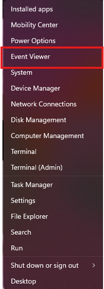
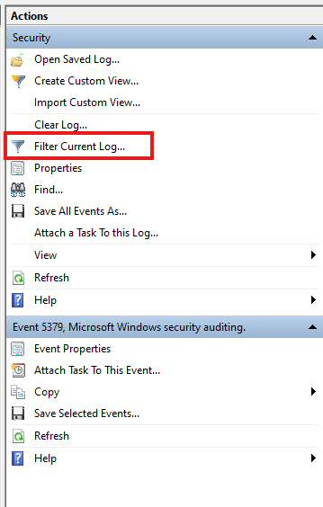
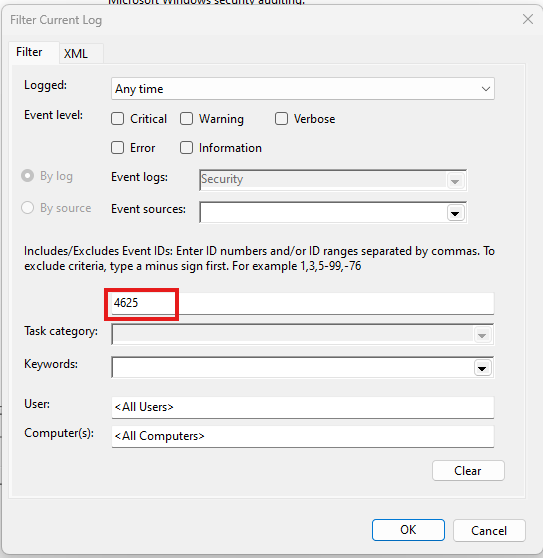
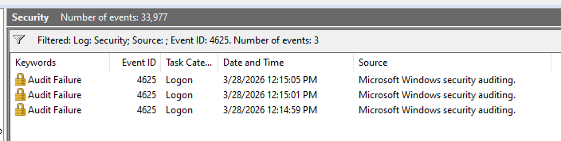
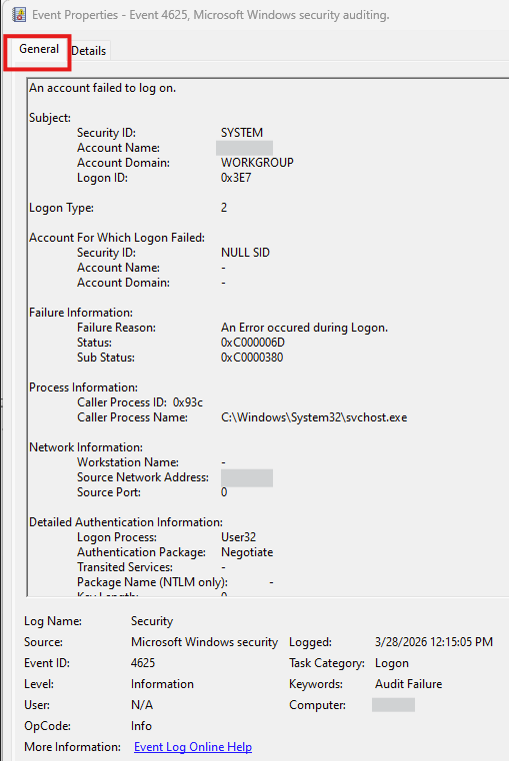

# Investigating Failed Logon Attempts on Windows with Event Viewer

## Objective
Use Event Viewer to identify and analyze failed logon attempts on a Windows system by filtering the Security log for Event ID 4625 and reviewing the event details relevant to authentication troubleshooting and basic security monitoring.

## Tools Used
- Event Viewer
- Windows Security Log

## Environment Used
- Windows 11 Pro

## Lab Description
This lab focuses on identifying failed logon attempts in Windows using Event Viewer. Reviewing failed authentication events is an important part of system administration, troubleshooting, and basic security monitoring.

In this exercise, I used the Windows Security log to filter for failed logon events and review the details associated with each attempt. I also examined the event fields that help explain which account was targeted, how the logon was attempted, and why the attempt failed.

## Skills Demonstrated
- Navigating Windows Event Viewer
- Filtering Windows Security logs by Event ID
- Identifying failed authentication activity
- Reviewing event fields relevant to basic security investigation
- Interpreting failed logon details for troubleshooting and monitoring
- Documenting technical findings in a structured format

## About Event ID 4625
Event ID **4625** is logged when an account fails to log on. This event can help identify normal user mistakes, account misconfigurations, repeated failed password attempts, or potentially suspicious authentication activity.

Reviewing this event is useful because it can reveal:
- which account was targeted
- when the failure occurred
- how the logon was attempted
- where the attempt came from
- why the logon failed

## Procedure

---

From the taskbar, right-click the **Windows Start** icon and select **Event Viewer**. Alternatively, open the **Windows Start** menu, search for **Event Viewer**, and select it from the search results.

---

From the left pane, navigate to **Event Viewer > Windows Logs > Security** to open the Security log in the center pane.

---

On the right side of the window, click **Filter Current Log** to open the filter dialog box.

---

In the **<All Event IDs>** field, type **4625** and click **OK** to apply the filter.

---

After filtering, the Security log will display failed logon events associated with Event ID 4625.

---

Double-click a failed logon event to open the **Event Properties** window and review the details on the **General** tab.

---

Review the key event fields to better understand the failed logon attempt.

## Key Event Fields to Review
When analyzing Event ID 4625, I focused on the following fields:

- **Account Name** – identifies the user account that failed to log on
- **Failure Reason** – explains why the logon attempt failed
- **Status / Substatus** – provides additional detail about the failure
- **Logon Type** – shows how the logon was attempted
- **Source Network Address** – identifies the source IP address when available
- **Source Port** – shows the originating network port when applicable
- **Workstation Name** – may indicate the system involved in the attempt
- **Process Name** – shows what process initiated the logon attempt
- **Time Created** – helps identify patterns or repeated failures over time

## Common Logon Types
Some useful logon types to recognize include:

- **2** – Interactive logon at the local console
- **3** – Network logon, such as accessing a shared resource
- **4** – Batch logon
- **5** – Service logon
- **7** – Unlock
- **8** – NetworkCleartext
- **10** – RemoteInteractive, often associated with Remote Desktop
- **11** – CachedInteractive

Understanding the logon type helps determine whether the failed attempt came from local interaction, network access, a service, or remote access.

## Analysis Notes
A single failed logon event is not always suspicious. It may simply indicate a mistyped password or an outdated credential. However, repeated failed logon attempts against the same account, multiple failures in rapid succession, or failures originating from unexpected systems or IP addresses may require further investigation.

When reviewing failed logon attempts, I looked for:
- repeated failures against the same username
- unusual logon types
- unexpected source IP addresses
- patterns in timestamps
- repeated attempts from the same workstation or process

## Example Investigation Questions
While reviewing failed logon events, I asked the following questions:
- Is this a single failed attempt or part of a repeated pattern?
- Is the targeted account a normal user account, service account, or administrator account?
- Does the logon type match expected behavior?
- Is the source IP address or workstation expected?
- Does the failure reason suggest a mistyped password, disabled account, or another issue?

## Key Takeaways
- Event ID **4625** identifies failed logon attempts in Windows.
- Event Viewer provides useful security information for troubleshooting and monitoring.
- A failed logon event can provide information about the account, source, logon type, and failure reason.
- Repeated failed logon attempts may indicate password issues, user error, misconfigurations, or suspicious activity.
- Reviewing event details can help support both troubleshooting and basic security investigation.

## Why This Matters
Knowing how to identify and interpret failed logon attempts is a useful foundational skill in IT and cybersecurity. Help desk staff may use these events to troubleshoot account issues, system administrators may use them to review authentication problems, and security analysts may use them to identify patterns that could indicate brute-force attempts, unauthorized access attempts, or misconfigured services.
